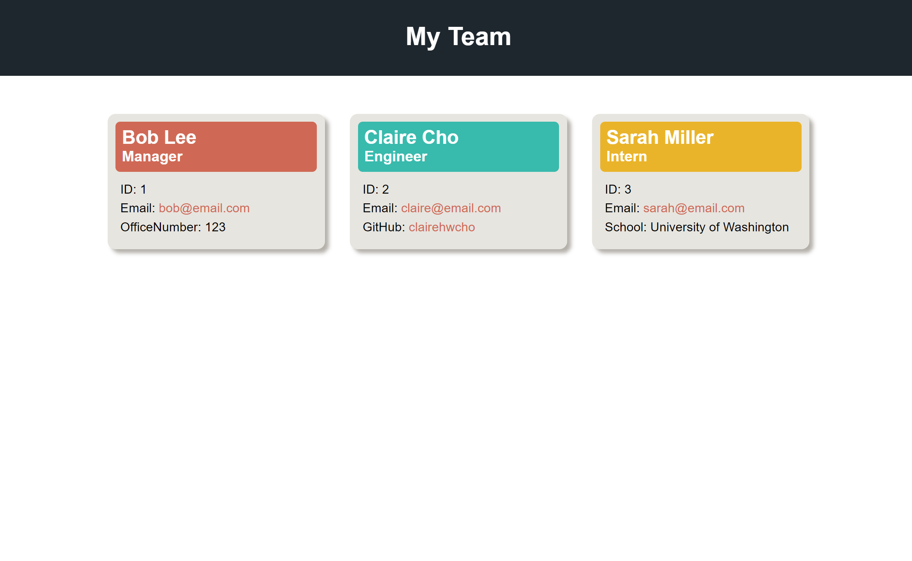

<!-- omit in toc -->
# Team Profile Generator

<!-- omit in toc -->
## Description

This is a command-line application that takes in information about employees on a software engineering team and generates an HTML webpage that displays summaries for each person using the Node.js and inquirer and jest package. When the application is invoked, user is prompted to enter team members and their information including name, employee ID, email address, manager's office number, engineer's GitHub username, and intern's school name. When user finishes building a team and exits the application, the HTML and CSS files are generated.

<!-- omit in toc -->
## Table of Contents
- [Installation](#installation)
- [Usage](#usage)
- [License](#license)

## Installation
- Install [Node.js v16](https://nodejs.org/en/blog/release/v16.16.0/)
- Install Node.js inquirer and jest package:
  ```
  npm i inquirer@8.2.4 jest
  ```

## Usage
- Index page


- Walkthro

<video src="https://user-images.githubusercontent.com/106784125/214694376-798ede0f-9c3e-4ecf-a24d-a7c01a26d446.mp4" width=600px></video>

ugh video


## License
Copyright © 2022 [Claire Cho](https://github.com/clairehwcho).
